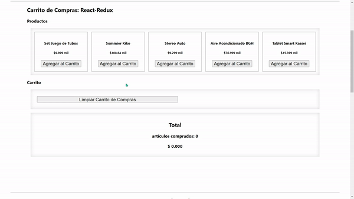

 <h2>Teoría y Conceptos</h2>
      <ul style={{ fontSize: "20px" }}>
        <li>
          <b>
            <i>Store</i>
          </b>
          , contiene el <i>state</i>, (uno por aplicación).
        </li>
        <li>
          <b>
            <i>Dispatch</i>
          </b>
          , ejecuta una acción que actualizará el <i>state</i>.
        </li>
        <li>
          <b>
            <i>Action</i>
          </b>
          , objeto <i>JS</i> con 2 propiedades: <i>type</i> y <i>payload</i>{" "}
          (datos).
        </li>
        <li>
          <b>
            <i>Subscribe</i>
          </b>
          , es un manejador de eventos para el <i>state</i>.
        </li>
        <li>
          <b>
            <i>Reducers</i>
          </b>
          , son funciones que gestionan los <i>actions</i>.
        </li>
      </ul>
      <h4>INSTALAR DEPENDENCIAS:</h4>
      <h5>redux - reactredux-reactdevtools</h5>
      <ol>
        <li>Crear carpetas: actions, types, reducers, store</li>
        <li>Reducers: utiliza combineReducers</li>
        <li>
          Store: importamos el createStore de redux y el reducer que hicimos
          antes, creamos la variable store, la subcribimos y la exportamos-:////
          {/* import { createStore } from "redux"; */}
          import reducer from "../reducers"; const store = createStore(reducer);
          {/* store.subscribe(() => {console.log(store);}); */}
          export default store; &lt;&gt;
        </li>
        <li>En App.js, envolver todo en un Provider con su store.</li>
        <li>
          En Types: crear todas las constantes exportables para la acciones.
        </li>
        <li>
          En Reducers: se crean las fuciones con el "Switch" y en el index se
          combinan las funciones, con el combineReducers.
        </li>
        <li>
          En el archivo del componente, tenemos q user useSelector y
          useDispatch.
        </li>
      </ol>
      <h4>Carrito de Compras:</h4>
      <ol>
        <li>Creamos las Aciones en Types..</li>
        <li>
          En las actions llamamos a las acciones de los Types con sus payload
        </li>
        <li>
          En el Reducer, hacer el switch, importando las acciones de types
        </li>
        <li>
          En el index de Reducer, llamar la funcion dentro del combineReducers
        </li>
        <li>
          En el archivo del componente, crear las variables con los useSelector
          y el useDispatch, destructurar el state, importar las acciones del
          actions con su payload.
        </li>
      </ol>

<h3>Recordar utilizar npm run fake-api para el Crud Api</h3>

      ***Para el carrito de comras se le agrego el total***

.

### `Gracias JM!!!`
